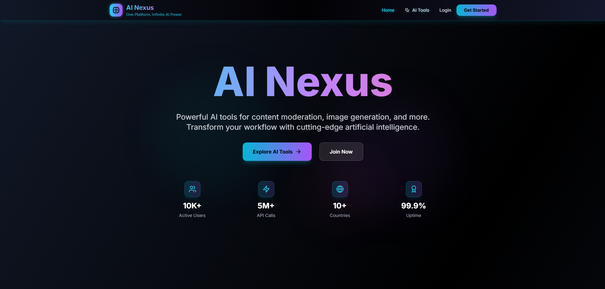
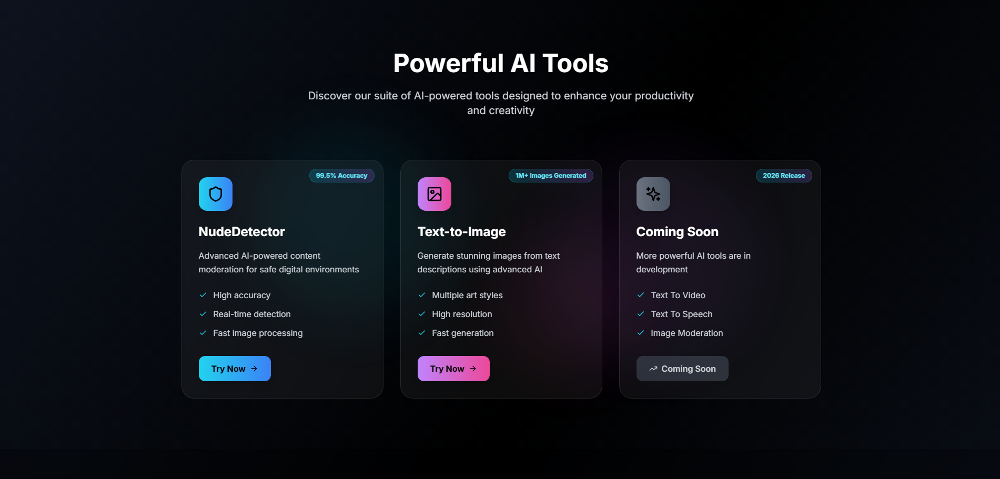
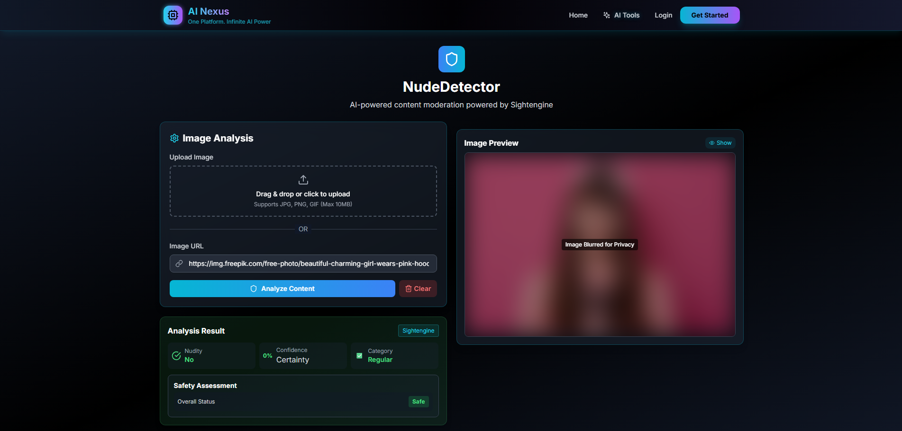
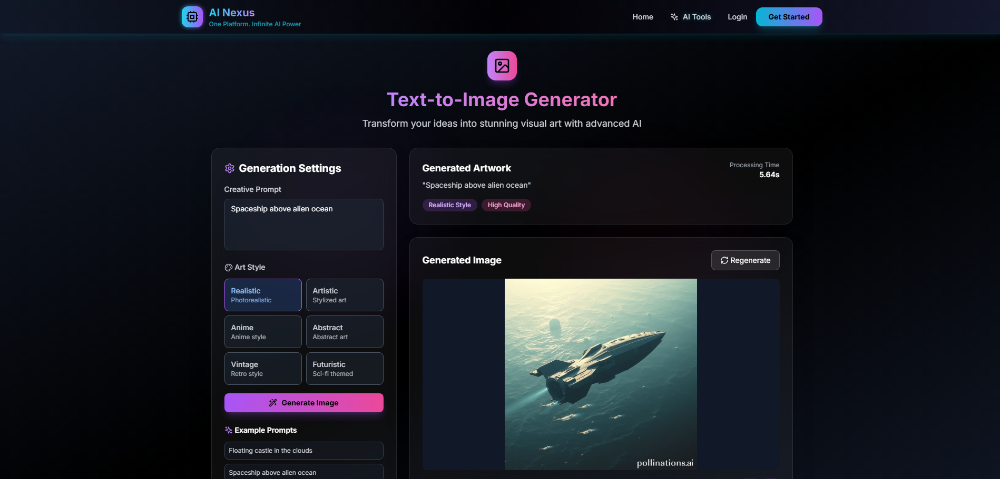
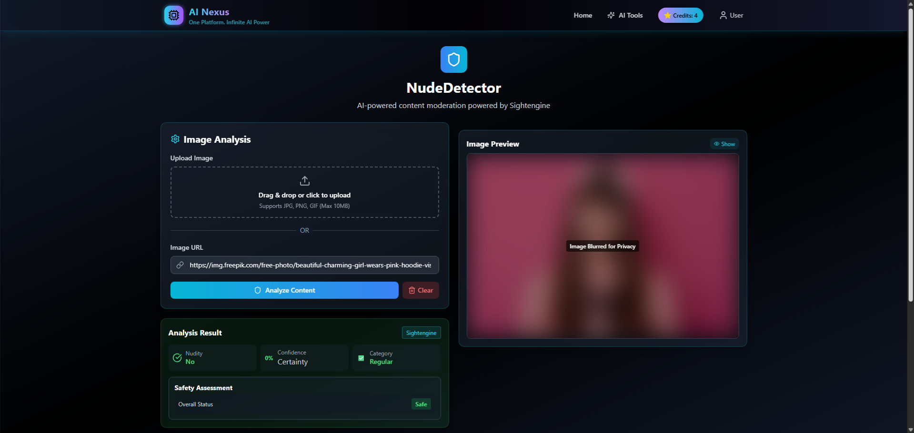
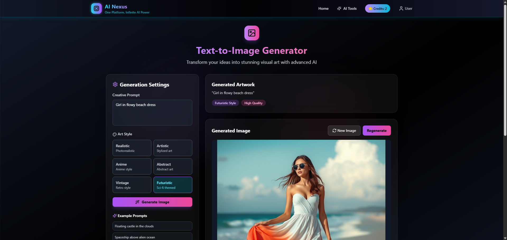

<h1 align="center">🤖 AI Nexus</h1>

<p align="center">
  <b>A SaaS platform with AI-powered tools like NudeDetector and Text-to-Image</b><br/>
  Fast, secure, and modern interface built using React, Node.js, Tailwind CSS, and Framer Motion.
</p>

<p align="center">
  
  
  
  
  
</p>

## 🚀 Features

* 🧠 **Multi-AI Tool Platform**

  * 🕵️ NudeDetector (Sightengine API)
  * 🎨 Text-to-Image Generator (Clip Drop API)
* 🔒 **Authentication**

  * Login/Signup with JWT
  * Google OAuth integration
* 💳 **Payments**

  * Stripe payment gateway integration
* 🖼️ Supports:

  * File/image uploads
  * Prompt-based text input
* 🌙 Modern dark theme with Tailwind CSS
* 🎞️ Smooth animations using **Framer Motion**
* ⚡ Blazing fast performance with Vite + React
* 🔧 Backend API routing with Node.js + Express

## 🔗 Live Preview

Check out the app here: [AI Nexus](https://ai-nexus-pro.vercel.app)

### ⚠️ Note

> The backend is hosted on **Render's free plan**, so it may take **a few seconds to wake up** after inactivity. Please be patient if the first API call takes longer than usual.

## 📸 Screenshots

<p align="center">
  
</p>
<p align="center">
  
</p>
<p align="center">
  
</p>
<p align="center">
  
</p>
<p align="center">
  
</p>
<p align="center">
  
</p>

## 📦 Installation

1. **Clone the Repository**

```bash
git clone https://github.com/mehulkumar22/AI-Nexus.git
cd AI-Nexus
```

2. **Install Frontend Dependencies**

```bash
cd frontend
npm install
```

3. **Install Backend Dependencies**

```bash
cd ../backend
npm install
```

4. **Environment Setup**

Create a `.env` file inside `/backend`:
```
MONGODB_URI= your_mongodb_uri_here
JWT_SECRET= your_jwt_secret_here
CLIPDROP_API= your_clipdrop_api_key_here
STRIPE_SECRET_KEY= your_stripe_secret_key_here
CURRENCY=INR
PORT=4000
SIGHTENGINE_USER= your_sightengine_user_here
SIGHTENGINE_SECRET= your_sightengine_secret_here
ALLOWED_ORIGINS=http://localhost:5173,https://your-frontend.vercel.app
GOOGLE_CLIENT_ID= your_google_client_id_here
GOOGLE_CLIENT_SECRET= your_google_client_secret_here
GOOGLE_CALLBACK_URL_PROD=https://your-production-backend.com/api/user/google/callback
GOOGLE_CALLBACK_URL_DEV=http://localhost:4000/api/user/google/callback

```

Create a `.env` file inside `/frontend`:

```
VITE_BACKEND_URL=http://localhost:4000,your_backend_url
```


## 📁 Folder Structure

```
AI-Nexus/
├── 📁backend
│   ├── 📁configs
│   ├── 📁controllers
│   ├── 📁middlewares
│   ├── 📁models
│   ├── 📁routes
│   ├── .env
│   ├── package.json
│   └── server.js
└── 📁frontend
    ├── 📁public
    ├── 📁src
    │   ├── 📁components
    │   ├── 📁context
    │   ├── 📁pages
    │   ├── App.jsx
    │   └── main.jsx
    ├── .env
    ├── index.html
    ├── package.json
    └── tailwind.config.js
```

## ▶️ Running the App

**Start Backend**

```bash
cd backend
npm start
```

**Start Frontend**

```bash
cd frontend
npm run dev
```

## 📬 Contact Me

* 📧 **Email:** [mehulkumar.mk02@gmail.com](mailto:mehulkumar.mk02@gmail.com)
* 💼 **LinkedIn:** [Mehul Kumar](https://www.linkedin.com/in/mehulkumar22)
* 💻 **GitHub:** [mehulkumar22](https://github.com/mehulkumar22)

## 🙌 Contributing

Feel free to fork this repo, submit issues, or open pull requests. Contributions are welcome!
