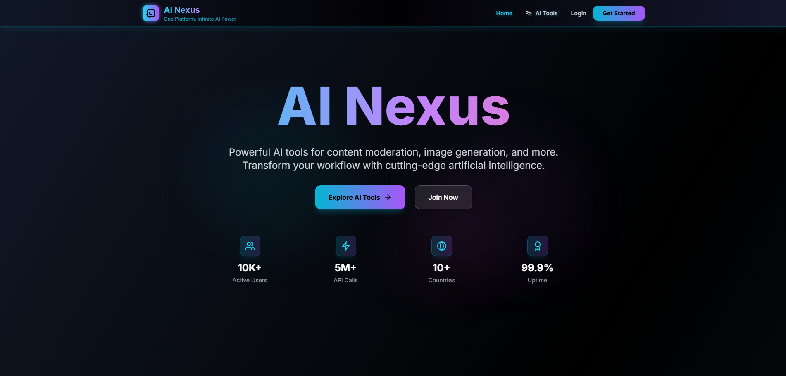
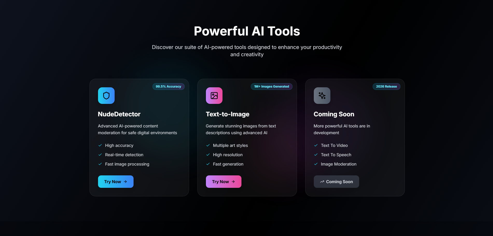
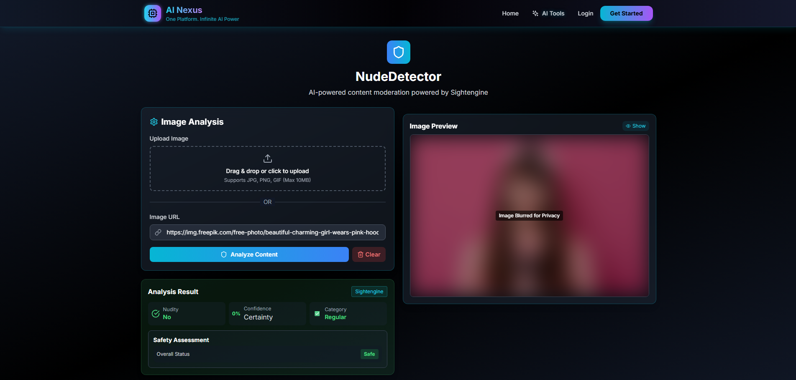
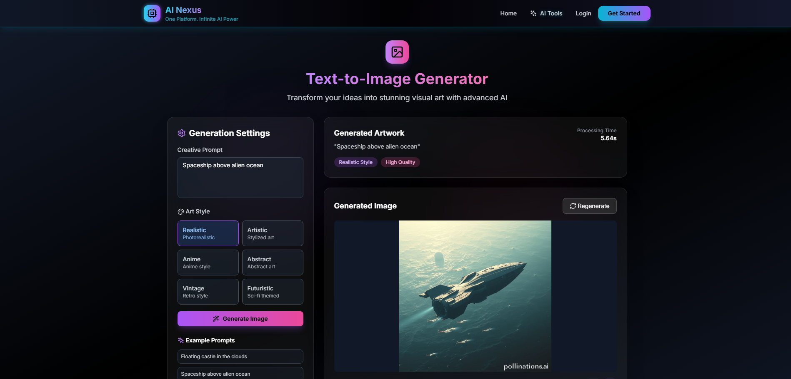

<h1 align="center">🤖 AI Nexus</h1>

<p align="center">
  <b>A SaaS platform with AI-powered tools like NudeDetector and Text-to-Image</b><br/>
  Fast, secure, and modern interface built using React, Node.js, Tailwind CSS, and Framer Motion.
</p>

<p align="center">
  
  
  
  
  
</p>

## 🚀 Features

- 🧠 **Multi-AI Tool Platform**
  - 🕵️ NudeDetector (Sightengine API)
  - 🎨 Text-to-Image Generator (Polinations API)
- 🖼️ Supports:
  - File/image uploads
  - Prompt-based text input
- 🌙 Modern dark theme with Tailwind CSS
- 🎞️ Smooth animations using **Framer Motion**
- ⚡ Blazing fast performance with Vite + React
- 🔧 Backend API routing with Node.js + Express

## 🔗 Live Preview

Check out the app here: [AI Nexus](https://ai-nexus-pro.vercel.app)

### ⚠️ Note

> The backend is hosted on **Render's free plan**, so it may take **a few seconds to wake up** after inactivity. Please be patient if the first API call takes longer than usual.


## 📸 Screenshots

<p align="center">
  
</p>

<p align="center">
  
</p>

<p align="center">
  
</p>

<p align="center">
  
</p>


## 📦 Installation

1. **Clone the Repository**
```bash
git clone https://github.com/mehulkumar22/AI-Nexus.git
cd AI-Nexus
````

2. **Install Frontend Dependencies**

```bash
cd frontend
npm install
```

3. **Install Backend Dependencies**

```bash
cd ../backend
npm install
```

4. **Environment Setup**
   Create a `.env` file inside `/backend` using `.env.example` as a reference:

```
PORT=5000
SIGHTENGINE_USER=your_user_here
SIGHTENGINE_SECRET=your_secret_here
ALLOWED_ORIGINS=http://localhost:5173,https://your-frontend.vercel.app
```

## 📁 Folder Structure

```
AI-Nexus/
├── 📁backend
│   ├── .env
│   ├── .env.example
│   ├── .gitignore
│   ├── index.js
│   ├── package-lock.json
│   ├── package.json
│   └── 📁routes
│       ├── nudeDetector.js
│       └── textToImage.js
├── 📁frontend
│   ├── .gitignore
│   ├── eslint.config.js
│   ├── index.html
│   ├── logo.png
│   ├── package-lock.json
│   ├── package.json
│   ├── postcss.config.js
│   ├── tailwind.config.js
│   ├── vite.config.js
│   └── 📁public
│       └── vite.svg
│   └── 📁src
│       ├── App.jsx
│       ├── index.css
│       ├── main.jsx
│       ├── 📁components
│       │   ├── Footer.jsx
│       │   └── Navbar.jsx
│       └── 📁pages
│           ├── Homepage.jsx
│           ├── Login.jsx
│           ├── NudeDetector.jsx
│           ├── Signup.jsx
│           └── TextToImage.jsx
└── README.md
```

## ▶️ Running the App

**Start Backend**

```bash
cd backend
npm start
```

**Start Frontend**

```bash
cd frontend
npm run dev
```

## 📬 Contact Me

* 📧 **Email:** [mehulkumar.mk02@gmail.com](mailto:mehulkumar.mk02@gmail.com)
* 💼 **LinkedIn:** [Mehul Kumar](https://www.linkedin.com/in/mehulkumar22)
* 💻 **GitHub:** [mehulkumar22](https://github.com/mehulkumar22)

## 🙌 Contributing

Feel free to fork this repo, submit issues, or open pull requests. Contributions are welcome!
